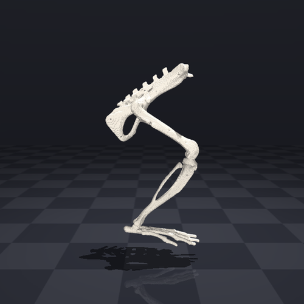
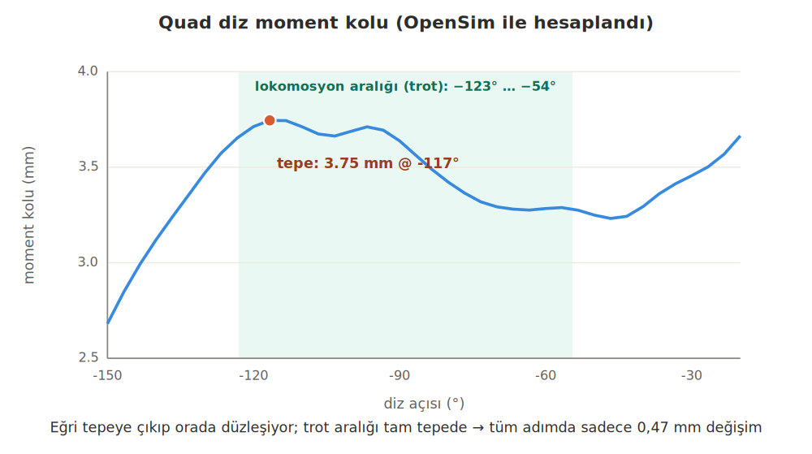
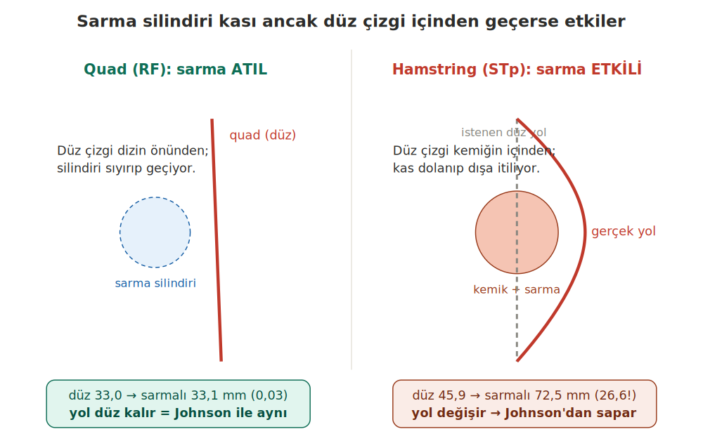

# Sıçan Arka Bacak Nöromekanik Boru Hattı

**Yöntem · Ana makaleden farklar · Doğrulama · Kod ve program rolleri · Avantaj/dezavantaj**

Ana makale: Johnson ve ark. 2008 (*J Biomech* 41(3):610–619)

---

## 1. Genel bakış

Bu çalışma, sıçanda yürümenin sinirden kaslara ve eklem hareketine uzanan zincirini kurmayı amaçlar. Bu ilk aşama, gerçek hayvan deneyi öncesinde yöntemi bilgisayarda (*in silico*) kurup doğrulamak için yapılmıştır; canlı hayvan kullanılmamıştır (n=1 model). Denek, yayımlanmış bir sıçan arka bacak kas-iskelet modelidir (Johnson ve ark. 2008; 6 gövde/segment, 38 kas). Bir tırıs (trot) döngüsünün kinematiği yeniden oluşturulmuş ve modelin geometrisi doğrulanmıştır. Kas kuvvetleri ve nöral sinyaller bu aşamada hesaplanmamıştır; onlar Faz-2'nin konusudur.



*Yeniden kurulan sıçan arka bacak iskeleti (render). Hareketli animasyon (gif) ve bu fotoğraf pakette `gorsel/` klasöründedir.*

---

## 2. Ana makaleden (Johnson 2008) farklarımız — nerede, ne kadar

Johnson 2008 bir geometri/moment-kolu modelidir: kas yolları düz çizgiler (origin→insertion) ve hareketli eklem merkezleriyle tanımlanır; sarma yüzeyi ve kalibre Hill kuvvet parametreleri yoktur (bunlar onun amacı değildir). Biz bu modelin bir OpenSim portunu (v0.2) kullandık. Farklar:

- **Sarma yüzeyleri:** Port, 13 sarma nesnesi (9 silindir + 2 küre + 2 torus) ekler — Johnson'ın makalesinde yoktur. Bunları biz eklemedik; modeli OpenSim'e çeviren kişi eklemiştir.
- **Yeniden kurulum:** Legacy (OpenSim 3.3) modelini OpenSim 4.x API'sinde bağımsız olarak yeniden kurduk.
- **Hareket üretimi:** Bir trot döngüsünü ters kinematikle (IK) ürettik; Johnson hareket üretmez, geometri verir.
- **Kuvvet:** Kuvvet hesaplamadık — yalnızca geometri/kinematik.

**Fark nerede yoğunlaşıyor?** Sarmada. Ölçtük: sarma quad'da atıldır (kas yolu ~0,03 mm değişir), hamstringde etkilidir (STp'nin kas yolu düz 45,9 mm'den sarmalı 72,5 mm'ye, yani +26 mm uzar — bu bir **yol** uzunluğu farkıdır, moment kolu değil). Yani Johnson'dan asıl sapmamız sarmalı fleksörlerdedir. Moment kollarının Johnson'la nicel eşleştiğini iddia etmedik.

---

## 3. Makaleden farklı olarak ek yaptıklarımız

- **Kendi Python FK motoru (`rig.py`):** spline-kuplajlı CustomJoint kinematiğini sıfırdan yeniden yazdık.
- **Bağımsız OpenSim yeniden kurulumu (`build_osim.py`):** legacy modeli 4.x API'sinde kurar.
- **MuJoCo'ya aktarım:** iskeletin render'ı için.
- **Trot döngüsü:** sönümlü en küçük karelerle IK (`walk.py`), ayak yörüngesinden.
- **İki bağımsız moment-kolu hesabı:** aşağıdaki doğrulama bölümünde.

---

## 4. Doğrulama (sağlama) yöntemlerimiz

- **(a) İki bağımsız ileri kinematik:** Python `rig.fk` ile OpenSim yeniden kurulumu aynı açılardan kemik konumlarını hesaplar; sonuçlar <0,1 mm örtüşür. Bu, aktarımın ve kodun doğruluğunu gösterir.
- **(b) İki bağımsız moment-kolu yöntemi:** OpenSim `computeMomentArm` (`ma_validate.py`) ile r=−dL/dθ (`clean_ma.py`) aynı sonucu verir (quad ≈ +3,7 mm). Bu, hesabın doğruluğunu gösterir.
- **(c) İşlevsel/anatomik kontroller:** kas boyları eklem açısıyla doğru yönde değişir (diz büküldükçe ekstansörler uzar, fleksörler kısalır); moment kolu işaretleri doğrudur (ekstansör +, fleksör −); quad değeri fizyolojik olarak makuldür.

> **Dürüst sınır:** bu doğrulamalar bizim kodumuzun ve aktarımın doğruluğunu gösterir — biyolojiyi ya da Johnson'la nicel eşleşmeyi değil. İki uygulama da aynı modeli kullandığından, model hatalıysa ikisi de aynı hatayı taşır.

---

## 5. Makaleyle örtüşmelerimiz

Johnson'ın ana bulgusu, moment kollarının lokomosyon aralığında tepe yapıp az değişmesi ve bunun nöral kontrolü basitleştirmesidir. Bizim quad'ımız bunu bağımsız hesabımızla yeniden üretir: quad diz moment kolu −117°'de 3,75 mm ile tepe yapar ve trotun kullandığı aralıkta (−123° … −54°) yalnızca 0,47 mm değişir. Ayrıca quad'da sarma atıl olduğundan yöntemimiz Johnson'ın yöntemine (düz çizgi + hareketli eklem) indirgenir; bu yüzden örtüşme sağlam zemindedir.

> **Dürüst sınır:** bu bir davranış (nitel) örtüşmesidir. Johnson'ın figüründeki sayının da birebir tuttuğunu göstermek için onun moment-kolu eğrisini sayısallaştırıp bu eğrinin üstüne koymak gerekir; bu henüz yapılmadı.



*Quad diz moment kolu (OpenSim ile hesaplandı): tepe −117°'de, trot aralığında yalnızca ~0,47 mm değişim.*

---

## 6. Hangi kod dosyası ne yapıyor ve nasıl çalışıyor

Veri akışı iki koldan ilerler. **RENDER kolu:** `convert_vtp` (mesh) → `rig.fk` (FK) → `walk.ik` (IK, trotu üretir) → `make_walk` (MuJoCo animasyon). **ANALİZ kolu:** `build_osim` (OpenSim'de yeniden kur) → `ma_validate` / `clean_ma` / `peak_ma` (moment kolları). `rat_trot.mot`, trotun OpenSim biçimidir; `peak_ma` bunu trot açı aralığı için okur, OpenSim ise oynatma için kullanır. Aşağıda her dosyanın işlevi ve en kritik kod bölümü verilmiştir.

### `convert_vtp.py`
Kemik mesh'lerini (VTK `.vtp`) obj'ye dönüştürür (render için hazırlık).

```python
for f in ['ground','spine','pelvis','femur','tibia','foot']:
    p, tr = parse_vtp(f'Geometry/{f}.vtp')      # .vtp -> köşe + üçgen
    meshio.write_points_cells(f'obj/{f}.obj', p, [('triangle', tr)])
```

### `rig.py` (`rig.fk`)
İleri kinematik motoru. `.osim`'in CustomJoint'lerini (natCubicSpline kuplajları dahil) parse eder; açılardan her kemiğin 4×4 dünya dönüşümünü hesaplar. `spline_eval`, diz açısı→öteleme kuplajını değerlendirir.

```python
def spline_eval(xs,ys,q): return float(np.interp(q,xs,ys))  # açı->öteleme (kuplaj)

def joint_T(b,coords):                    # bir eklemin dönüşümü
    for e in b['rots']:  R = R @ axis_angle(e[0], val(e,coords))   # dönmeler
    for e in b['trans']: t = t + val(e,coords)*e[0]               # ötelemeler (kuplaj)

def fk(coords):                           # zincir: kemik = ebeveyn x eklem
    for b in bodies:
        W[b['name']] = W[b['parent']] @ joint_T(b,coords)   # kök: birim matris
    return W
```

### `walk.py` (`walk.ik`)
Ters kinematik. Sürdüğü açılar: `hip_flx`, `knee_flx`, `ankle_flx`. Ayak parmağı yörüngesine sönümlü en küçük karelerle çözüm yapar; içeride `rig.fk` çağırır. Trotu bellek içinde bir açı dizisi olarak üretir (`solve_cycle`); `make_walk` bunu doğrudan çizer.

```python
CTRL=['hip_flx','knee_flx','ankle_flx']       # sürülen 3 sagittal açı
for _ in range(iters):
    for i,k in enumerate(CTRL): c[k]=q[i]
    cur=toe_world(c)                          # rig.fk ile parmağı bul
    err=np.array([target_xz[0]-cur[0], target_xz[1]-cur[2]])
    dq=J.T@np.linalg.solve(J@J.T+lam*np.eye(2), err)  # sönümlü en küçük kareler
    q=q+dq; q=np.clip(q, lo, hi)              # güncelle + eklem limiti
```

### `build_osim.py`
Legacy modeli OpenSim 4.x API'sinde yeniden kurar (bodies, spline'lı joints, 13 wrap, 38 kas). Wrapping'i OpenSim hesaplar. `rig.py` ve `wrap.py`'ye bağımlıdır. (`10.0` = placeholder maks kuvvet; geometri için kullanılmaz.)

```python
for mm in wrap.MUS:                        # 38 kas
    mu=osim.Thelen2003Muscle(mm['name'], 10.0, mm['ofl'] or 0.05, ...)
    for i,(b,loc) in enumerate(mm['pts']):    # bağlanma noktaları
        mu.addNewPathPoint(f"{mm['name']}_p{i}", bod[b], osim.Vec3(*loc))
    for wn in mm['wraps']:                     # sarma atamaları (.osim'den)
        gp.addPathWrap(bod[WOBJ[wn]['body']].getWrapObject(wn))
    m.addForce(mu)
```

### `ma_validate.py`
OpenSim `computeMomentArm` ile diz moment kollarını açı boyunca hesaplar. Quad ≈ +3,7 mm sonucu buradan gelir.

```python
for kd in range(-120,-19,10):              # dizi -120°..-20° tara
    d=dict(base); d['knee_flx']=kd*DEG; set_pose(d)
    for n in names:
        ma = musc.get(n).computeMomentArm(s, knee)*1000.0   # m -> mm
```

### `clean_ma.py`
Moment kolunu r=−dL/dθ ile hesaplar (`ma_validate`'e bağımsız çapraz kontrol).

```python
def knee_ma(n):                           # r = -dL/dθ (merkezi fark)
    d['knee_flx']=k0+h; setc(d); Lp=L(n)
    d['knee_flx']=k0-h; setc(d); Lm=L(n)
    return -(Lp-Lm)/(2*h)
```

### `peak_ma.py`
Quad moment-kolu eğrisini tarar; tepeyi ve trot aralığındaki değişimi verir. Bu belgedeki 3,75 mm ve 0,47 mm sayıları buradan.

```python
for d in deg:                             # diz açısını -150°..-20° tara
    knee.setValue(s, np.radians(d)); m.realizePosition(s)
    r.append(np.mean([mus.get(n).computeMomentArm(s,knee)*1000 for n in QUAD]))
band=(deg>=kmin)&(deg<=kmax)              # trot aralığı
print(r[band].max()-r[band].min())        # -> 0,47 mm
```

### `make_walk.py`
Trot animasyonunu çizer: `rig.fk` kemik pozlarını hesaplar, MuJoCo bunları mocap gövde olarak yerleştirip render eder (fizik/kas yok).

```python
for i in range(N):
    W=rig.fk(cs[i])                       # açı -> kemik konumu (FK)
    for j,b in enumerate(BONES):
        d.mocap_pos[j]  = Rg@W[b][:3,3]    # kemiği mocap gövde olarak koy
        d.mocap_quat[j] = rig.mat2quat(Rg@W[b][:3,:3])
    mujoco.mj_forward(m,d); frames.append(r.render())   # sahneyi güncelle + çiz
```

### `wrap.py`
Sarma tanımlarını ve kas noktalarını `.osim`'den okur; `build_osim` bunları kullanır. (İçindeki hızlı moment-kolu sürümü yaklaşıktır; güvenilir olan OpenSim'inkidir.)

```python
for body in root.iter('Body'):            # sarma yüzeylerini .osim'den oku
    for w in (body.find('.//WrapObjectSet/objects') or []):
        WOBJ[w.get('name')]=dict(body=..., radius=..., length=...)  # silindir/küre/torus
for mus in root.iter('Thelen2003Muscle'): # kas noktaları + sarma atamaları
    MUS.append(dict(name=..., pts=..., wraps=[...]))
```

### Model dosyaları — hangi `.osim` ne

- **`rat_hindlimb_0.2.osim` (GİRDİ):** kodun okuduğu kaynak dosya. Johnson 2008 portu, legacy OpenSim 3.3 formatı, 38 kas. `rig.py` / `wrap.py` / `build_osim.py` hepsi bunu parse eder — bu pakette bulunan tek `.osim` budur.
- **`rat_rebuilt.osim` (ÇIKTI):** `build_osim.py` çalıştırılınca üretilir; OpenSim 4.x formatı, aynı 38 kaslı model. Pakette hazır gelmez, scripti çalıştırınca oluşur.
- **`rat_big_clean.osim` (ANİMASYON):** 35 kaslı, büyütülmüş görselleştirme sürümü (kalça çevresi 3 kas — IP, OE, OI — gizli). Bu minimal pakette yoktur; tam pakette bulunur.

Özet ve belgedeki '38 kas' tam modeli, '35 kas' ise yalnız animasyon sürümünü anlatır. Kod her zaman `rat_hindlimb_0.2.osim`'den (girdi) kurar ve `rat_rebuilt.osim`'i (çıktı) üretir; ikisi aynı modelin iki formatıdır.

---

## 7. Hangi program ne için kullanıldı

- **Python — tutkal katman:** kendi ileri kinematiğimiz (`rig.py`), ters kinematik (`walk.py`), model yeniden kurulum scripti (`build_osim.py`) ve analiz. Kütüphaneler: numpy, scipy.
- **OpenSim — biyomekanik:** kas yolları, sarma, moment kolları ve (Faz-2) kuvvet. Güvenilir moment-kolu motoru; +3,7 quad değeri OpenSim'in `computeMomentArm`'ından gelir.
- **MuJoCo — yalnızca render:** kemikleri (mocap gövde) çizer. Kas, kuvvet ya da fizik simülasyonu içermez.

---

## 8. Avantajlar ve dezavantajlar

### Avantajlar
- **Quad'da sabit moment kolu → nöral kontrol kolaylığı:** trot aralığında ~0,47 mm değişim; Johnson'ın bulgusuyla örtüşen, savunulabilir bir sonuç.
- **İki bağımsız doğrulama:** FK <0,1 mm; iki moment-kolu yöntemi aynı sonuç → kod ve aktarım sağlam.
- **Quad'da sarma atıl:** yöntem Johnson'a indirgeniyor → quad sonucu güvenilir.
- **Açık kaynak:** gerçek deneye hazır bir altyapı.

### Dezavantajlar
- **Hamstringde optimize olmayan sarma (wrapler):** kalibre değil; sarma kas yolunu şişiriyor (STp: düz 45,9 → sarmalı 72,5 mm, ~+26 mm yol) ve moment kollarını güvenilmez kılıyor. Faz-2'de kuvvet = tork / moment kolu olduğu için bu değerleri bozar; ölçüme kalibre edilmeli ya da kaldırılmalı.
- **Tendon boşluk boyu = 0:** eksik Hill parametresi; kuvvet için Faz-2'de doldurulmalı (Eng 2008 / referans-postür).
- **Kuvvet henüz hesaplanmadı:** bu aşama yalnızca kinematik/geometri.
- **Nicel karşılaştırma eksik:** Johnson'la figür-figür karşılaştırma henüz yapılmadı (örtüşme nitel).
- **n=1 model:** gerçek hayvan verisi yok; bu aşama yöntem doğrulamadır.



*Dezavantaj örneği — sarma quad'da atıl (yol düz kalır) ama hamstringde etkili (yol dışa itilir, moment kolu şişer).*

---

